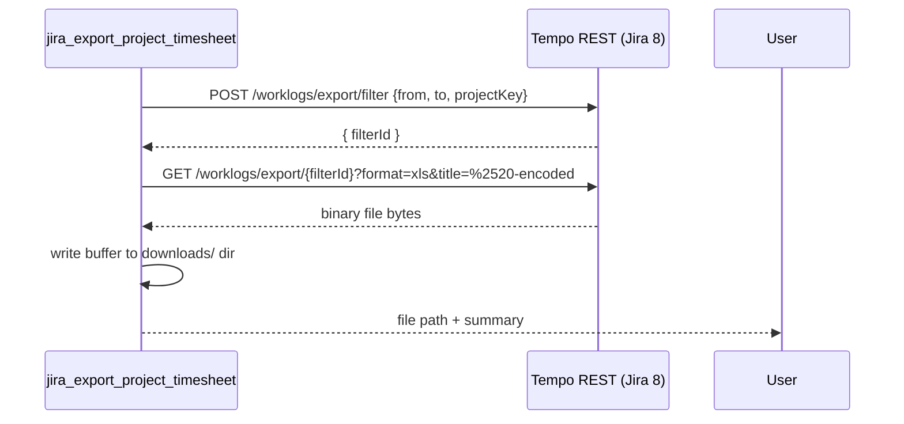

# Export Project Timesheet (xlsx) — Design Spec

**Date:** 2026-08-07
**Status:** Draft — pending user review

## Problem

There is currently no way to export the Tempo timesheet (worklogs from **all members**) of a single Jira project for an arbitrary date range into a spreadsheet file. Existing tools only cover:

- `jira_search_worklogs` — requires an explicit `workers` list (no project-wide filter).
- `jira_get_timesheet_approvals` / `jira_get_timesheet_approval_log` — scoped to Tempo **teams**, not Jira **projects**, and return approval status/audit trail, not raw worklog rows.

The user wants a new tool that produces an `.xlsx` (or Jira's native export format) file covering one project's full timesheet across a date range, using Jira/Tempo's own export format rather than a custom-built spreadsheet.

## Discovery

`public-timesheets.openapi.yaml` only documents `POST /rest/tempo-timesheets/4/worklogs/search`, which needs an explicit `worker` array. Its request schema (`SearchParamsBean`, lines 1071-1190) does however show a `projectKey` array field, confirming Tempo's underlying filter model supports project-wide queries.

The user captured real network traffic from `jira8.runsystem.info` when using the Tempo Timesheets UI's "Export" button. This matches a well-documented (if undocumented-by-Atlassian) two-step Tempo Server/DC flow, also independently confirmed on the Atlassian Community forums (a user "reverse engineered the API calls needed to export this report via API by first calling `.../worklogs/export/filter` to get the filter [id] and then calling `.../worklogs/export/(filter id)` with two parameters — format and title"):

1. **`POST /rest/tempo-timesheets/4/worklogs/export/filter`** — body shaped like `SearchParamsBean` (`from`, `to`, `projectKey: [...]`). Response contains a generated filter id (the user's captured example: `8cbcd13f059a4ad99085b1f9353b70fc`).
2. **`GET /rest/tempo-timesheets/4/worklogs/export/{filterId}?format=<fmt>&title=<title>`** — streams back the binary export file. The user's captured URL: `.../worklogs/export/8cbcd13f059a4ad99085b1f9353b70fc?format=csv&title=Project%253A%2520Microcopy%2520E-learning%2520System%2520(ME)`.

Decoding the captured `title` value twice (`%253A` → `%3A` → `:`) yields `Project: Microcopy E-learning System (ME)` — i.e. the value on the wire is **double URL-encoded**. To reproduce this exactly, the export URL must be built manually (not via axios `params`, which would only encode once).

Per Tempo's own documentation ("Exporting Reports"), "Export to Excel" on Tempo Server/DC historically produces `.xls` (legacy binary Excel), not `.xlsx`. Since this project has no live network access to `jira8.runsystem.info` to verify the exact `format` value or filter-id response shape, the implementation treats these as **configurable, testable assumptions** — flagged explicitly below — rather than hard-coded certainties.



## Decisions (confirmed with user)

1. **Output destination:** Save the exported file to the local downloads folder (`cfg.ATTACHMENT_WORKSPACE`, same directory already used by `jira_add_attachment`/`jira_upload_attachment_content`). Return the absolute file path in the tool response. (No auto-attach-to-issue option in this iteration — YAGNI; can be added later by chaining with `jira_upload_attachment_content`.)
2. **File content/structure:** Use Jira/Tempo's own native export output as-is (no custom-built workbook). This means no new spreadsheet-writing dependency (e.g. exceljs) is needed — the file bytes come directly from Tempo.
3. **Endpoint call shape:** Two-step filter+export flow described above, using `projectKey` (not a resolved member list) so it covers every member automatically.
4. **Format handling:** Tool accepts a `format` input (default `"xlsx"`), but internally the value sent to Tempo and the file extension written to disk are derived carefully (see Open Risks) since the true supported values are unverified.

## Architecture

### New endpoint builders — `src/jira/endpoints.ts`

```typescript
export function tempoWorklogsExportFilterUrl(baseUrl: string): string {
  return `${baseUrl}${TEMPO_API_BASE}/worklogs/export/filter`;
}

export function tempoWorklogsExportUrl(baseUrl: string, filterId: string): string {
  return `${baseUrl}${TEMPO_API_BASE}/worklogs/export/${encodeURIComponent(filterId)}`;
}
```

### New raw type — `src/types/jira-api.ts`

```typescript
/** Response shape from POST /worklogs/export/filter — field name is unverified against a live instance. */
export interface TempoRawExportFilterResponse {
  filterId?: string;
  id?: string;
  uuid?: string;
}
```

### New client method — `src/jira/http-client.ts`

`exportProjectTimesheet(input: { dateFrom: string; dateTo: string; projectKey: string; title: string; format: string }): Promise<{ buffer: Buffer; contentType?: string; contentDisposition?: string }>`

- **Step 1 (filter):** `POST tempoWorklogsExportFilterUrl(...)` with body `{ from: dateFrom, to: dateTo, projectKey: [projectKey] }`. Parse the response body trying, in order: a raw string body, `body.filterId`, `body.id`, `body.uuid`. If none match, throw `jiraResponseError(...)` including the raw payload — this is the primary "fix after live test" seam.
- **Step 2 (export):** Build the URL manually: `${tempoWorklogsExportUrl(baseUrl, filterId)}?format=${encodeURIComponent(format)}&title=${encodeURIComponent(encodeURIComponent(title))}` (double-encode title to match the captured behavior), then `GET` with `responseType: "arraybuffer"` and header override `Accept: "*/*"`.
- Reuse `checkForAuthFailure(status, url, "")` / `assertOk(status, url, "")` exactly as `downloadAttachment` (`src/jira/http-client.ts:623`) does for binary responses.
- Return `{ buffer, contentType: res.headers["content-type"], contentDisposition: res.headers["content-disposition"] }`.

### New tool — `src/tools/export-project-timesheet.ts`

**Schema:**
```typescript
export const exportProjectTimesheetSchema = z.object({
  projectKey: z.string().min(1, "projectKey is required").describe("Jira project key, e.g. PROJ"),
  dateFrom: z.string().regex(DATE_REGEX, "dateFrom must be in yyyy-MM-dd format"),
  dateTo: z.string().regex(DATE_REGEX, "dateTo must be in yyyy-MM-dd format"),
  format: z.enum(["xlsx", "xls", "csv"]).optional().default("xlsx"),
});
```

**Handler flow:**
1. Validate input; `loadAndValidateSession`.
2. `client.getProjects()` → find matching `projectKey` to build `title = "Project: {name} ({key})"`; fallback to `"Project: {projectKey}"` if not found (never fail the export over a missing title).
3. `client.exportProjectTimesheet({ dateFrom, dateTo, projectKey, title, format })`.
4. `fs.mkdir(cfg.ATTACHMENT_WORKSPACE, { recursive: true })`.
5. Determine file extension: prefer parsing `contentDisposition` (`filename="....xlsx"`) → else map `contentType` (`application/vnd.openxmlformats-officedocument.spreadsheetml.sheet` → `xlsx`, `application/vnd.ms-excel` → `xls`, `text/csv` → `csv`) → else fall back to the requested `format`.
6. Sanitize filename: `timesheet_${projectKey}_${dateFrom}_to_${dateTo}_${Date.now()}.${ext}` (all inputs are already regex-validated, so no extra sanitization needed beyond this template).
7. `fs.writeFile(fullPath, buffer)`.
8. Return markdown: project, period, resolved format/extension, file path, human file size, plus a `navigationHint` pointing at `jira_upload_attachment_content` (base64 encoding) if the user wants it attached to a Jira issue afterward.
9. Every error path (`isMcpError` or generic `Error`) returns `{ isError: true, content: [...] }` per project convention; the filter-id-parse failure specifically surfaces the raw Tempo response so it's fast to diagnose against the live instance.

### Server registration — `src/server.ts`

Register as `jira_export_project_timesheet`. No `WRITE_CONFIRMATION` — this tool doesn't mutate Jira, only reads Tempo data and writes a local file (same class as `jira_search_worklogs`).

### Docs

- New `docs/tools/jira_export_project_timesheet.md` following the existing template (Purpose / Input Schema / Output / Examples / See Also).
- Update `docs/superpowers/specs/tempo-timesheet-workflow.md`: add a row to the Tool Map table + one new Use Case ("Export full project timesheet to Excel").

## Testing

`src/tests/export-project-timesheet.test.ts`, following the `search-worklogs.test.ts` pattern:
- Mock `JiraHttpClient` (`exportProjectTimesheet`, `getProjects`) and `node:fs/promises` (`mkdir`, `writeFile`) — no real disk I/O in unit tests.
- Schema validation: rejects bad dates, empty `projectKey`, invalid `format`.
- Success path: `writeFile` called with the expected buffer; response text contains file path, project, period.
- Auth passthrough: `AUTH_REQUIRED`/`SESSION_EXPIRED` from `loadAndValidateSession` surfaces as `isError: true`.
- Filter-id-parse failure: `exportProjectTimesheet` rejects with `JIRA_RESPONSE_ERROR` → handler returns `isError: true` with the raw payload visible in the message.

## Open Risks (explicitly unverified — flag to user for live testing)

1. **Filter-id response field name** — unknown until tested; code probes `filterId`/`id`/`uuid`/raw-string.
2. **`format` value for true Excel** — Tempo's own docs suggest legacy `.xls` for "Export to Excel"; the user's captured example used `format=csv`. It's possible `format=xlsx` is not accepted at all. The extension-detection logic (via response headers) protects against mislabeling the file even if the requested format differs from what's returned.
3. **Double-encoded `title`** — implemented as observed, but if Tempo's parser instead expects single-encoding, this needs adjustment.

These are called out to the user as the first thing to verify after implementation; none of them block writing correct, testable code — they only affect exact param values, which are isolated to `exportProjectTimesheet()` in `http-client.ts`.

## Out of Scope (YAGNI)

- Auto-attaching the exported file to a Jira issue (can be chained manually via `jira_upload_attachment_content` afterward).
- Building a custom xlsx workbook client-side (rejected — user wants Jira's native export format).
- Per-member breakdown/summary sheets (comes for free if Tempo's native Excel export already includes a "Users" tab, per Tempo's docs; no extra work needed on our side).
